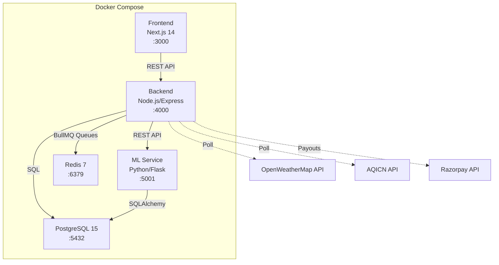
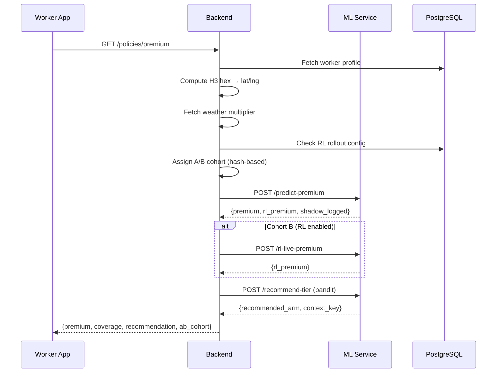
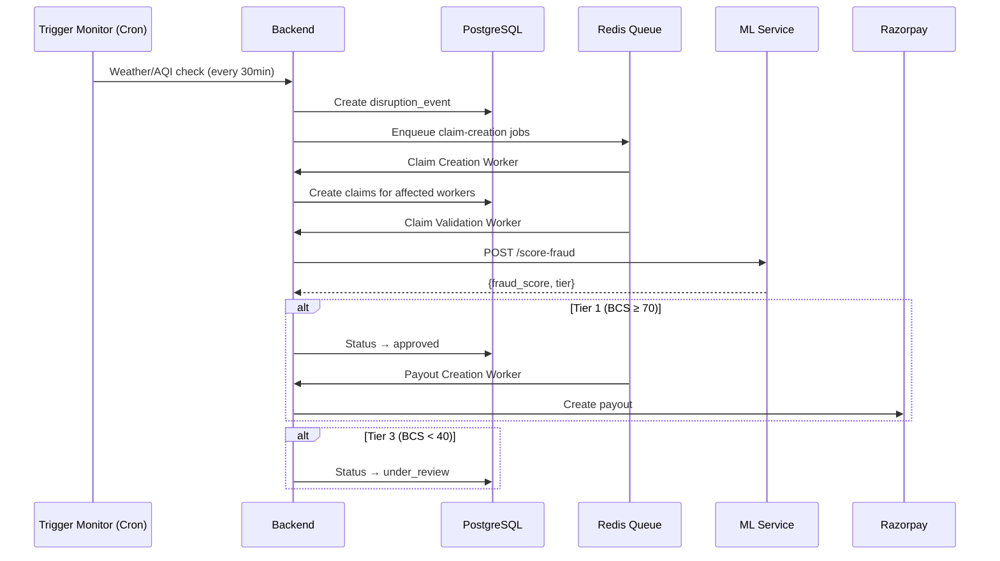

# GigGuard Architecture

> Technical architecture and system design for the GigGuard parametric insurance platform.

---

## Table of Contents

- [System Overview](#system-overview)
- [Service Architecture](#service-architecture)
- [Data Flow](#data-flow)
- [Database Schema](#database-schema)
- [Background Jobs & Queues](#background-jobs--queues)
- [Security & Auth](#security--auth)
- [Geospatial System (H3)](#geospatial-system-h3)

---

## System Overview

GigGuard is a microservices platform with **5 containers** orchestrated via Docker Compose:



---

## Service Architecture

### Frontend (Next.js 14)
| Aspect | Detail |
|--------|--------|
| Framework | Next.js 14, TypeScript, Tailwind CSS |
| Port | 3000 |
| Pages | Landing, Login, Register, Dashboard, Buy Policy, Claims, Insurer Dashboard, Insurer Login |
| State Management | React Context (AuthContext) |
| Key Feature | 3-step policy purchase with Thompson Sampling recommendation UI |

### Backend (Node.js/Express)
| Aspect | Detail |
|--------|--------|
| Framework | Express.js, TypeScript |
| Port | 4000 |
| Route Modules | workers, policies, claims, insurer, triggers, payouts, razorpay, health |
| Background Jobs | Trigger Monitor (cron), Policy Expiry (cron) |
| Queue Workers | Claim Creation, Claim Validation, Payout Creation |
| Database Driver | `pg` (node-postgres) |
| Queue System | BullMQ via Redis (ioredis) |

### ML Service (Python/Flask)
| Aspect | Detail |
|--------|--------|
| Framework | Flask 3.0, Gunicorn |
| Port | 5001 |
| Models | Premium Calculator, Isolation Forest, Thompson Sampling Bandit, SAC RL (shadow), GraphSAGE GNN (groundwork) |
| Database Driver | SQLAlchemy + psycopg2 |
| Key Feature | All ML models isolated from business logic; graceful fallbacks if models unavailable |

### PostgreSQL 15
| Aspect | Detail |
|--------|--------|
| Version | 15-alpine |
| Port | 5432 |
| Schemas | 9 migration files (001–009) |
| Extensions | GIN indexes for H3 geospatial queries |

### Redis 7
| Aspect | Detail |
|--------|--------|
| Version | 7-alpine |
| Port | 6379 |
| Usage | BullMQ job queues for async claim/payout processing |

---

## Data Flow

### Premium Calculation Flow



### Claim Processing Flow



---

## Database Schema

### Migration History

| # | File | Purpose |
|---|------|---------|
| 001 | `001_init.sql` | Core tables: workers, policies, claims, disruption_events, payouts, insurer_profiles |
| 002 | `002_add_fraud_score.sql` | Add fraud_score columns to claims |
| 003 | `003_add_h3_columns.sql` | Add home_hex_id to workers, affected_hex_ids to disruption_events |
| 004 | `004_add_h3_gin_indexes.sql` | GIN indexes for H3 hex lookups |
| 005 | `005_add_policy_bandit_columns.sql` | Bandit audit fields: recommended_arm, arm_accepted, context_key, bandit_state table |
| 006 | `006_phase2_schema_alignment.sql` | Schema alignments for Phase 2 features |
| 007 | `007_seed_demo_data.sql` | Demo/seed data for development |
| 008 | `008_runtime_schema_compat.sql` | Runtime compatibility patches |
| 009 | `009_phase3_rl_schema.sql` | RL tables: rl_rollout_config, rl_ab_assignments, rl_daily_metrics; ab_cohort/pricing_source on policies |

### Core Tables

```
workers
├── id (UUID PK)
├── name, phone_number, platform, city, zone
├── home_hex_id (BIGINT — H3 geospatial index)
├── avg_daily_earning, zone_multiplier, history_multiplier
├── experience_tier, upi_vpa
└── created_at

policies
├── id (UUID PK)
├── worker_id (FK → workers)
├── week_start, week_end, status
├── weekly_premium, premium_paid, coverage_amount
├── zone_multiplier, weather_multiplier, history_multiplier
├── recommended_arm, arm_accepted, context_key (bandit audit)
├── ab_cohort, pricing_source (RL A/B)
├── razorpay_order_id, razorpay_payment_id
└── purchased_at

claims
├── id (UUID PK)
├── policy_id (FK → policies)
├── worker_id (FK → workers)
├── disruption_event_id (FK → disruption_events)
├── trigger_type, trigger_value, trigger_threshold
├── payout_amount, disruption_hours
├── fraud_score, isolation_forest_score
├── bcs_score, graph_flags (JSONB)
├── status (triggered → validating → approved/under_review/denied → paid)
└── created_at, paid_at

disruption_events
├── id (UUID PK)
├── trigger_type, city, zone
├── trigger_value, trigger_threshold
├── affected_hex_ids (BIGINT[] — GIN indexed)
├── affected_workers_count, total_payout_amount
├── disruption_hours, status
└── event_start

payouts
├── id (UUID PK)
├── claim_id (FK → claims)
├── amount, status, razorpay_payout_id
└── created_at, completed_at

bandit_state
├── id (INT PK, always 1)
├── state (JSONB — full bandit parameters)
└── updated_at

rl_shadow_log
├── id (UUID PK)
├── worker_id, formula_premium, rl_premium
├── state_vector (JSONB), action_value
├── formula_won (BOOLEAN)
└── logged_at

rl_rollout_config
├── id (INT PK, always 1)
├── rollout_percentage (0–100)
├── kill_switch_engaged (BOOLEAN)
└── updated_at

rl_ab_assignments
├── worker_id (VARCHAR PK)
├── cohort (A or B)
└── assigned_at
```

---

## Background Jobs & Queues

### Cron Jobs (Node.js)

| Job | Schedule | Description |
|-----|----------|-------------|
| **Trigger Monitor** | Every 30 minutes | Polls OpenWeatherMap and AQICN APIs for each active zone. Creates disruption events when thresholds are breached. Uses 6-hour anti-duplication window. |
| **Policy Expiry** | Daily | Marks expired policies (past week_end) as `expired`. |

### BullMQ Queue Workers

| Worker | Queue | Description |
|--------|-------|-------------|
| **Claim Creation** | `claim-creation` | Creates claim records for all workers in a disruption zone. Uses H3 hex matching. |
| **Claim Validation** | `claim-validation` | Calls ML service `/score-fraud`. Routes to Tier 1/2/3 based on BCS score. |
| **Payout Creation** | `payout-creation` | Creates Razorpay payout for approved claims. Falls back to mock payout in dev. |
| **Sync Fallback** | N/A | Synchronous fallback if Redis is unavailable. Processes jobs inline. |

---

## Security & Auth

| Layer | Implementation |
|-------|---------------|
| **Worker Auth** | JWT (HS256) via `JWT_SECRET`. Token issued on login/register. |
| **Insurer Auth** | JWT with role=insurer. Requires `INSURER_LOGIN_SECRET` to obtain. |
| **Payment Verification** | Razorpay HMAC-SHA256 signature verification on policy purchase. |
| **Webhook Verification** | Razorpay webhook HMAC via `RAZORPAY_WEBHOOK_SECRET`. Raw body parsing for signature check. |
| **CORS** | Permissive (`*`) — to be restricted in production. |
| **Fraud Detection** | Multi-layer: Isolation Forest ML model → GNN cluster detection (Phase 3) → BCS tiering. |

---

## Geospatial System (H3)

GigGuard uses Uber's **H3 hexagonal grid system** (Resolution 8 — ~0.74 km² per hexagon) for precise geospatial matching.

| Component | Detail |
|-----------|--------|
| Library | `h3-js` v4 |
| Resolution | 8 (fixed) |
| K-ring | 1 (7 hexagons total, ~2 km radius) |
| Worker Field | `workers.home_hex_id` (BIGINT) |
| Event Field | `disruption_events.affected_hex_ids` (BIGINT[]) |
| Indexing | GIN indexes on both fields (25–50× query speedup) |
| Backfill | `npm run backfill:hex-ids` — geocodes worker zones via Google Maps API |

For detailed API usage, see [H3_API_REFERENCE.md](H3_API_REFERENCE.md) and [H3_IMPLEMENTATION_GUIDE.md](H3_IMPLEMENTATION_GUIDE.md).
